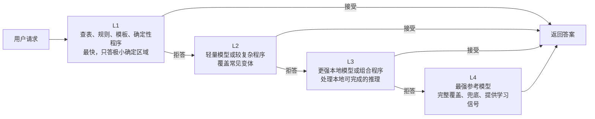
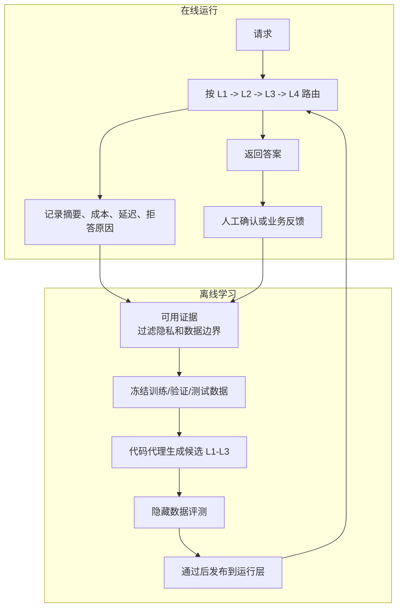
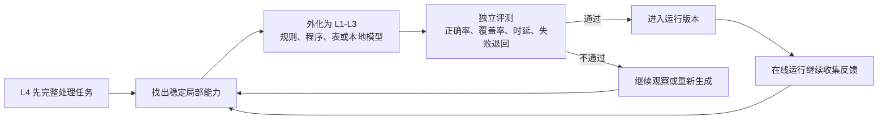

# Darjeeling 是什么

Darjeeling 是一个四层 AI 运行系统。L1 是最快的局部答案：查表、规则、模板或确定性程序，只答极小但几乎确定的问题。L2 是轻量模型或较复杂程序，覆盖更多常见变体。L3 是更强的本地模型或组合程序，处理需要推理但仍可本地完成的请求。L4 是最强参考模型，覆盖完整任务，负责兜底，也提供学习信号。

这四层按时延、正确率和覆盖率排列。越靠近 L1，回答越快、成本越低、范围越窄；越靠近 L4，覆盖越广，但更慢、更贵。Darjeeling 的核心 idea 是让系统从 L4 的回答中学习，把 L4 已经稳定展现出的能力外化成 L1-L3 的本地能力。

请求进来时，系统依次问 L1、L2、L3、L4。前三层必须能拒答：会答就返回，不会答就交给下一层。拒答不是失败，而是边界控制；低层只接自己稳定掌握的部分，避免为了覆盖更多而乱答。

学习循环是：先让 L4 完整处理任务；从历史回答、运行反馈和人工确认中找出稳定能力；让代码代理把这些能力做成本地程序；再用代理没看过的数据检查时延、正确率、覆盖率和失败退回。通过检查的程序进入 L1-L3，下一轮继续从 L4 吸收能力。

所以，Darjeeling 不是简单缓存，也不是一次性蒸馏。它要做的是把强模型的能力逐步产品化为更快、更便宜、可拒答、可评测的本地层。用户只需定义输入输出、答对标准、可用数据和隐私边界；具体任务语义留在目标定义里，核心框架保持任务无关。

## 架构图：四层各司其职

这张图的重点是“拒答”。L1-L3 不需要回答所有问题；它们只在自己可靠的区域回答，其他请求交给下一层。这样系统可以把低时延留给简单稳定的请求，把困难请求留给 L4。

## 数据流图：运行数据怎样变成下一轮能力

运行时只长期保存适合观察和改进的摘要。原始输入、输出或人工反馈只有在任务的隐私规则允许时，才会进入下一轮数据。冻结数据和隐藏评测的作用，是防止本地层只记住样例，而不能泛化到新请求。

## 核心方法示意图：从 L4 外化能力

可以把核心门槛简化成下面这个式子。候选本地能力 \(A\) 不是“看起来会答”就能上线，而是要同时满足正确率、覆盖率和时延要求：

$$
\operatorname{Promote}(A)=1
\iff
\operatorname{Precision}(A)\ge P_{\min}
\land
\operatorname{Coverage}(A)>0
\land
\operatorname{Latency}(A)\le T_{\max}
$$

这里的 \(P_{\min}\) 和 \(T_{\max}\) 由具体任务设定。实际系统还会检查失败能否安全退回 L4、不同数据切片是否稳定、以及运行后是否出现漂移。对第一次了解项目的人来说，可以先记住一句话：Darjeeling 让 L4 做老师，把已经稳定的能力逐步沉淀到更快的 L1-L3。
