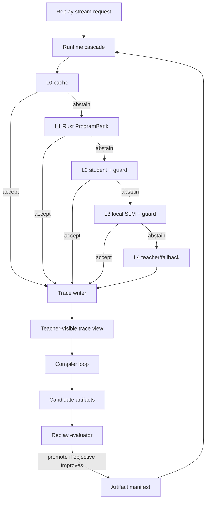

# 01 总体架构

Darjeeling 是一个 profile-guided edge intelligence runtime MVP。它展示云端强模型能力如何把高频、低熵、可验证的 NLU workload 子分布逐步编译到更便宜的本地层级。

## 固定层级

```text
L0 exact / semantic cache
L1 Rust native CPU ProgramBank evolved by L4 coding agent
L2 L4-distilled tiny trainable student + learned guard
L3 L4-optimized local SLM prompt, configurable disabled/shadow/guarded-enabled
L4 cloud LLM teacher / proposal generator / coding-agent compiler / fallback
```

## 核心循环



## 不变量

- 主 demo 不 mock teacher label、L1 native program、L2 student、L3 local SLM 或 replay。
- Hidden gold labels only serve evaluation/reporting.
- Router、compiler、L1 evolution agent、L2 training、L3 prompt optimization、guard training 均不能读取 gold label。
- L4 可以生成或修改候选 artifact，但不能认证 artifact。
- Replay/evaluator 是唯一 promotion authority。
- 弱层默认 abstain；coverage 增长必须受 wrong accept gate 约束。
- MVP promotion 先以 artifact set 为单位；单层 regression 是已知遗留问题，report 必须显式展示。
- L3 启用时必须是真实 local SLM；硬件不足时可以 disabled 或 shadow，不阻塞 L0/L1/L2/L4 主链路。

## Run directory

```text
runs/<timestamp>/
  settings.json
  stream.json
  traces.jsonl
  teacher_cache.jsonl
  hard_buffer.jsonl
  compiler/
    gen_000/
      contexts/
      l4_requests.jsonl
      l4_responses.jsonl
      l1_agent/
        prompt.md
        transcript.jsonl
        diff.patch
        commands.jsonl
        agent_report.md
      candidate_metrics.csv
      promotion.json
  artifacts/
    manifest.current.json
    generations/
  reports/
    summary.md
    curves.html
    metrics.csv
    artifacts.csv
    hard_cases.jsonl
```

`runs/latest` 可以是 symlink 或复制标记文件，但实现要兼容不支持 symlink 的平台。
