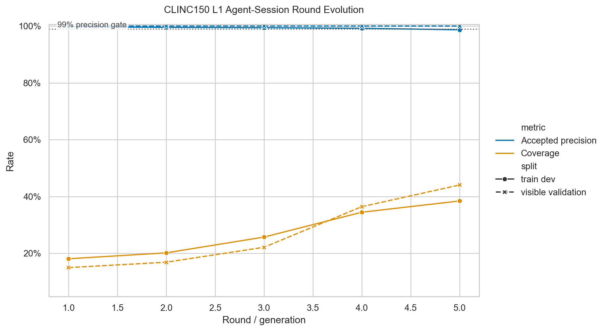
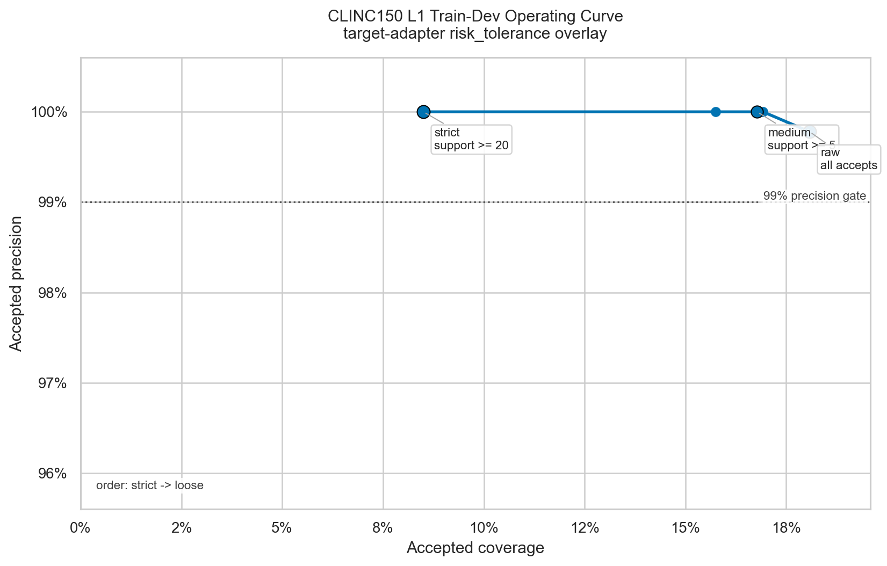
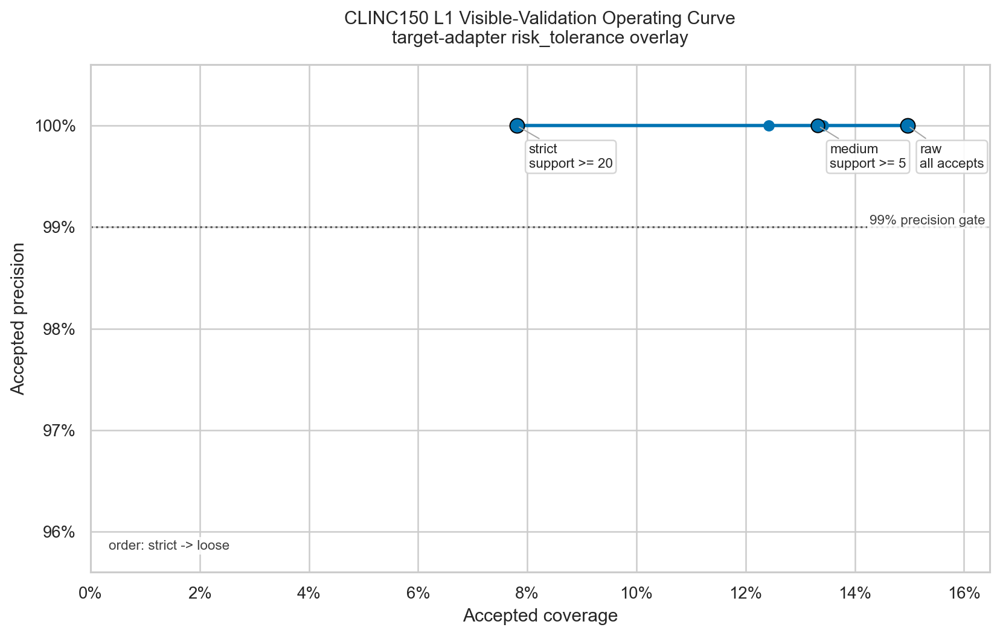
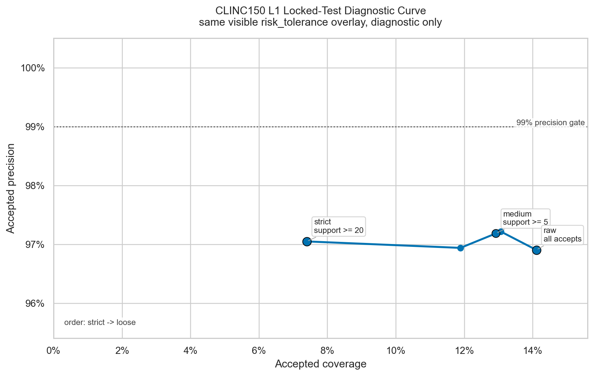
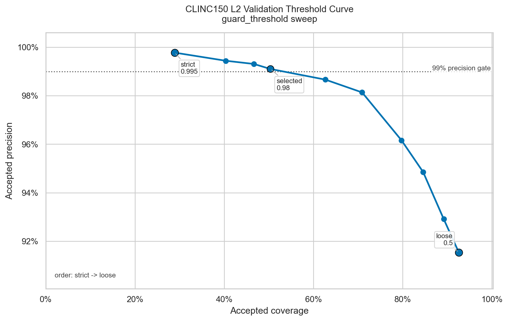
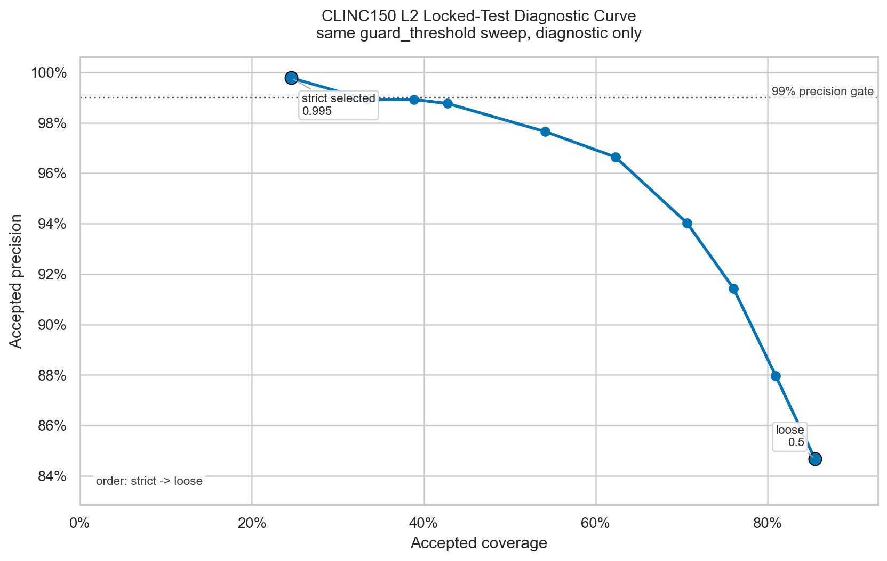
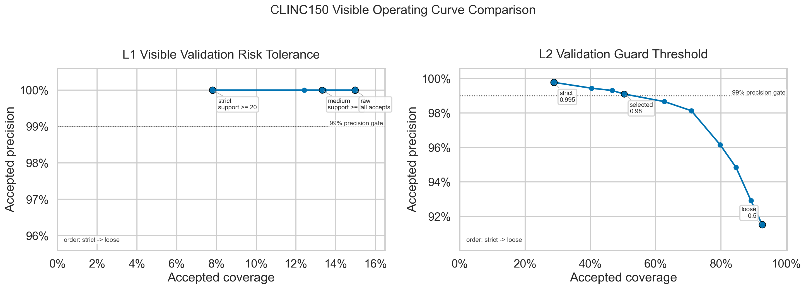

# Precision-Coverage Visualization Facility Report

Date: 2026-06-24

Decision: **adopt the repaired single-knob operating-curve standard**.

The first frontier design was useful as a data backfill, but insufficient as a
standard figure. It mixed train-dev, validation, locked-test diagnostics,
policy families, summary-only context points, and Pareto markers in the same
scatter views. The repaired standard is stricter: one layer, one candidate, one
split, and one accept-policy knob per connected curve.

## Outputs

Normalized data:

- [round_metrics.jsonl](precision_coverage/round_metrics.jsonl): 30 rows.
- [operating_points.jsonl](precision_coverage/operating_points.jsonl): 75 rows.
- [pareto_frontier.jsonl](precision_coverage/pareto_frontier.jsonl): 63 rows.

Standard figures:















Debug appendix figure:

- [debug_clinc150_l2_evolution.png](precision_coverage/figures/debug_clinc150_l2_evolution.png)

Visual QA notes: [precision_coverage/visual_qa.md](precision_coverage/visual_qa.md).

## Code And Contracts

Core, target-neutral:

- `darjeeling.eval.plots.write_normalized_jsonl`
- `darjeeling.eval.plots.read_normalized_jsonl`
- `darjeeling.eval.plots.annotate_pareto_frontier`
- `darjeeling.eval.plots.pareto_frontier_rows`
- `darjeeling.eval.plots.validate_operating_curve_rows`
- `darjeeling.eval.plots.plot_single_operating_curve`
- `darjeeling.eval.plots.plot_operating_curve_facets`
- `darjeeling.eval.plots.plot_evolution_curve`

The core helpers only depend on normalized fields such as `experiment_id`,
`layer`, `candidate_id`, `split`, `accepted_precision`, `coverage`,
`curve_id`, `knob_name`, `knob_order`, and `source_artifact`. They do not
inspect CLINC150 labels, intents, OOS status, utterances, frames, or
layer-specific target semantics.

Target-specific:

- `darjeeling.targets.nlu.precision_coverage` parses CLINC150 L1/L2 historical
  artifacts into normalized rows.
- L1 operating curves use target-adapter `risk_tolerance` overlays over
  recorded accepts. This is not an L1 ProgramBank feature, and the L1 evolve
  agent does not see plotting, frontier, or risk-tolerance mechanics.
- L2 operating curves use a `guard_threshold` sweep over recorded guard
  probabilities.
- `edge-mvp-nlu clinc150 precision-coverage-backfill` regenerates the JSONL data
  files and PNG figures from historical artifact paths.

Each connected curve is grouped by `curve_id`. Standard plotting refuses to
connect mixed `curve_id` rows. Locked-test diagnostic curves have separate
`curve_id` values and `selection_scope=locked_test_diagnostic`.

## Parsed Historical Artifacts

Fully supported by per-round or per-request artifacts:

- CLINC150 L1 real 5-round agent-session summary and prediction JSONL files:
  `/Users/chenmohan/gits/darjeeling-clinc150-l1-agent-session-effect/runs/clinc150-l1-agent-session-effect-20260624/main-agent-session-5round/`
- CLINC150 L2 cascade summaries and prediction JSONL files:
  `/Users/chenmohan/gits/darjeeling/runs/clinc150-l2-cascade-20260623/`

Summary-only imports:

- Calibration repair summaries:
  `/Users/chenmohan/gits/darjeeling-clinc150-calibration-repair/runs/clinc150-calibration-repair-20260624/`
- L2 AutoResearch summary:
  `/Users/chenmohan/gits/darjeeling-clinc150-l2-autoresearch/runs/clinc150-l2-autoresearch-20260624/agent-session-r1/`

These rows are marked as `curve_role=discrete_context` with
`"artifact_support": "partial_summary_only"` metadata. They remain table/data
context and are not connected into standard operating curves.

## Figure Support Level

Standard:

- L1 round evolution for the five real `agent-session` rounds on train-dev and
  visible validation.
- L1 train-dev `risk_tolerance` curve for selected round 001.
- L1 visible-validation `risk_tolerance` curve for selected round 001.
- L1 locked-test diagnostic `risk_tolerance` curve for selected round 001,
  using the same predeclared visible overlay.
- L2 teacher-full validation `guard_threshold` curve.
- L2 teacher-full locked-test diagnostic `guard_threshold` curve.
- L1/L2 visible comparison as two facets, not a shared connected curve.

Debug:

- L2 candidate evolution across historical train-size/model-family candidates.

No mixed scatter/Pareto frontier PNG is retained as a standard output.

## Findings From The Backfill

L1 visible validation stays at 100% accepted precision across the
`risk_tolerance` overlay. The selected round's raw point accepts 14.97% of
visible-validation rows; the medium clean-support overlay accepts 13.32%; the
strict overlay accepts 7.81%. On train-dev, raw accepts 18.08% at 99.78%
accepted precision, while strict/medium overlays preserve 100% accepted
precision at lower coverage.

The L1 operating curve can only move left from raw L1. It filters recorded L1
accepts into abstains; it cannot create new coverage or repair missing rules.
Future rightward movement requires a better L1 candidate, not just a looser
overlay.

The L1 locked-test diagnostic curve is deliberately separate. It shows the same
visible overlay would not reach the 99% precision gate on locked test: strict
accepts 7.40% at 97.05% precision, and raw accepts 14.11% at 96.91% precision.
Those locked-test outcomes were not used to choose the overlay.

L2 teacher-full validation shows a readable threshold trade-off. The strict
0.995 guard accepts 28.87% at 99.78% precision; the selected 0.98 validation
threshold accepts 50.32% at 99.10% precision; the loose 0.50 point accepts
92.58% at 91.53% precision. Locked test is a separate diagnostic curve using
the same threshold list.

## Future Experiment Guidance

Future L1/L2 experiments should emit or regenerate:

- `round_metrics.jsonl` for candidate evolution over rounds, generations, or
  static candidate families.
- `operating_points.jsonl` for candidate-local accept-policy sweeps.
- `pareto_frontier.jsonl` for data/debug context, grouped by curve identity when
  `curve_id` is available.

Operating rows should include:

- `experiment_id`, `layer`, `candidate_id`, `round`, `split`, `view`;
- `accepted_precision`, `coverage`, `accepted`, `wrong_accepts`;
- `curve_id`, `curve_role`, `knob_name`, `knob_value`, `knob_label`,
  `knob_order`, `knob_direction`, and `primary_curve`;
- `selection_scope` such as `agent_visible` or `locked_test_diagnostic`;
- `source_artifact` as an absolute path when artifacts live outside the current
  worktree;
- optional target metadata under `metadata`.

For L1, operating policies should remain target-adapter overlays unless a
future serving decision explicitly promotes `candidate artifact + target
adapter overlay` together. The generated L1 ProgramBank and the L1 evolve agent
do not need to know about plotting, Seaborn, Pareto frontiers, or operating
sweeps.

## Validation

Generation command:

```bash
uv run --extra dev python -m darjeeling.targets.nlu.main_cli clinc150 precision-coverage-backfill \
  --out-dir docs/experiments/precision_coverage \
  --l1-summary /Users/chenmohan/gits/darjeeling-clinc150-l1-agent-session-effect/runs/clinc150-l1-agent-session-effect-20260624/main-agent-session-5round/clinc150_l1_agent_session_effect_summary.json \
  --l2-cascade-root /Users/chenmohan/gits/darjeeling/runs/clinc150-l2-cascade-20260623 \
  --calibration-summaries /Users/chenmohan/gits/darjeeling-clinc150-calibration-repair/runs/clinc150-calibration-repair-20260624/clinc150_calibration_repair_summary.json,/Users/chenmohan/gits/darjeeling-clinc150-calibration-repair/runs/clinc150-calibration-repair-20260624/safety-margin-995/clinc150_calibration_repair_summary.json \
  --autoresearch-summary /Users/chenmohan/gits/darjeeling-clinc150-l2-autoresearch/runs/clinc150-l2-autoresearch-20260624/agent-session-r1/clinc150_l2_autoresearch_summary.json
```

Validation completed:

```bash
uv run --extra dev pytest tests/test_precision_coverage_plots.py -q
uv run --extra dev pytest tests/targets/nlu/test_clinc150_phase1.py tests/test_precision_coverage_plots.py -q
uv run --extra dev ruff check src/darjeeling/eval/plots.py src/darjeeling/targets/nlu/precision_coverage.py src/darjeeling/targets/nlu/main_cli.py tests/test_precision_coverage_plots.py
git diff --check
```

Results:

- precision/coverage focused pytest: 7 passed;
- required CLINC150 + precision/coverage pytest: 34 passed;
- touched-file Ruff: passed;
- `git diff --check`: passed.
