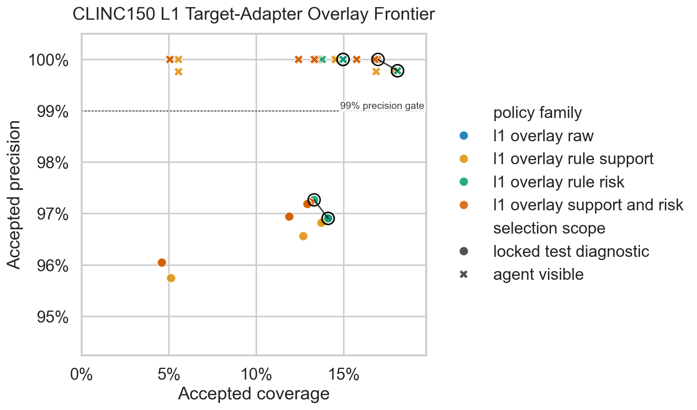
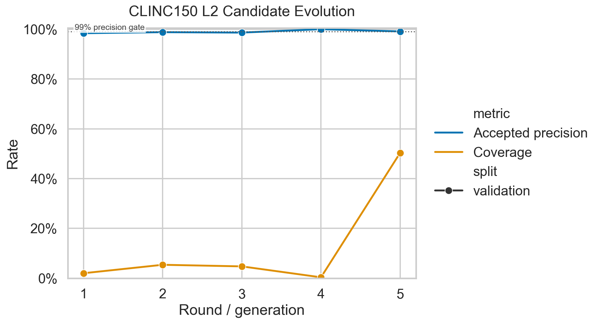
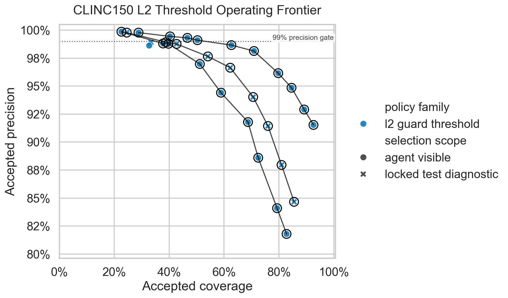
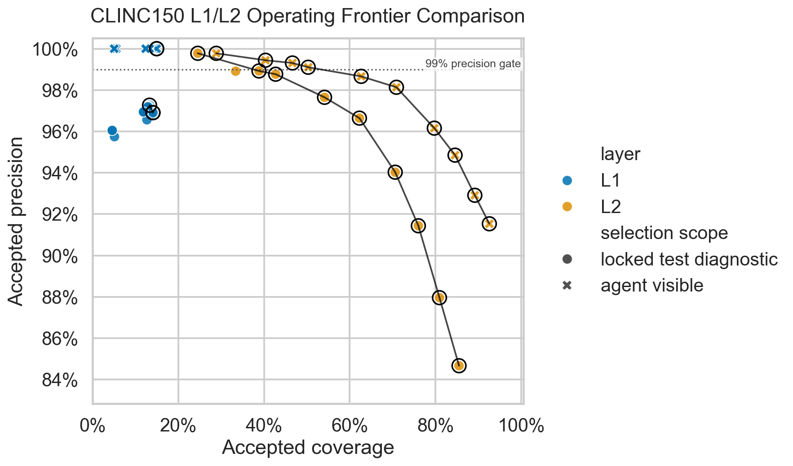

# Precision-Coverage Visualization Facility Report

Date: 2026-06-24

Decision: **adopt the standard precision/coverage static reporting pattern**.

The implementation adds target-neutral normalized precision/coverage data files,
Pareto frontier selection, and Seaborn static figures. CLINC150-specific
artifact parsing stays in the NLU target package. L1 operating policies are
target-adapter overlays over recorded L1 outputs; they are not L1 artifact
requirements and the L1 evolve agent does not see plotting or frontier logic.

## Outputs

Normalized data:

- [round_metrics.jsonl](precision_coverage/round_metrics.jsonl): 30 rows.
- [operating_points.jsonl](precision_coverage/operating_points.jsonl): 150 rows.
- [pareto_frontier.jsonl](precision_coverage/pareto_frontier.jsonl): 67 rows.

Figures:










Visual QA notes: [precision_coverage/visual_qa.md](precision_coverage/visual_qa.md).

## Code And Contracts

Core, target-neutral:

- `darjeeling.eval.plots.write_normalized_jsonl`
- `darjeeling.eval.plots.read_normalized_jsonl`
- `darjeeling.eval.plots.annotate_pareto_frontier`
- `darjeeling.eval.plots.pareto_frontier_rows`
- `darjeeling.eval.plots.plot_evolution_curve`
- `darjeeling.eval.plots.plot_operating_frontier`

The core helpers only depend on normalized fields such as `experiment_id`,
`layer`, `candidate_id`, `split`, `accepted_precision`, `coverage`, and
`source_artifact`. They do not inspect CLINC150 labels, intents, OOS status,
utterances, frames, or layer-specific target semantics.

Target-specific:

- `darjeeling.targets.nlu.precision_coverage` parses CLINC150 L1/L2 historical
  artifacts into normalized rows.
- `edge-mvp-nlu clinc150 precision-coverage-backfill` regenerates the JSONL data
  files and PNG figures from historical artifact paths.

Dependencies:

- Added `seaborn>=0.13.0` to the base project dependencies. This brings pandas
  into the base plotting environment through Seaborn.

## Parsed Historical Artifacts

Fully supported by per-round or per-request artifacts:

- CLINC150 L1 real 5-round agent-session summary and prediction JSONL files:
  `/Users/chenmohan/gits/darjeeling-clinc150-l1-agent-session-effect/runs/clinc150-l1-agent-session-effect-20260624/main-agent-session-5round/`
- CLINC150 L2 cascade summaries and prediction JSONL files:
  `/Users/chenmohan/gits/darjeeling/runs/clinc150-l2-cascade-20260623/`

Partial summary-only imports:

- Calibration repair summaries:
  `/Users/chenmohan/gits/darjeeling-clinc150-calibration-repair/runs/clinc150-calibration-repair-20260624/`
- L2 AutoResearch summary:
  `/Users/chenmohan/gits/darjeeling-clinc150-l2-autoresearch/runs/clinc150-l2-autoresearch-20260624/agent-session-r1/`

Summary-only rows are marked with metadata such as
`"artifact_support": "partial_summary_only"`. They are discrete operating
points, not reconstructed threshold/frontier sweeps.

## Figure Support Level

Complete:

- L1 round evolution for the five real `agent-session` rounds on train-dev and
  visible validation.
- L1 selected-candidate operating frontier for round 001, generated as a
  target-adapter overlay over recorded L1 accepts.
- L2 teacher-full threshold operating frontier from per-request prediction rows
  on validation, validation zipf-heavy, validation uniform, and locked test.
- L1/L2 frontier comparison using the L1 selected candidate and L2 teacher-full
  threshold sweep.

Partial or discrete:

- L2 candidate evolution uses historical summary threshold rows for older
  train-size and model-family candidates. This is enough for an evolution curve
  but not a per-candidate sweep for every older artifact.
- Calibration repair and AutoResearch points are imported as summary-only
  discrete points because those reports did not preserve every sweep input in
  the same normalized shape.

## Findings From The Backfill

L1 visible validation stayed at 100% accepted precision while coverage rose from
14.97% to 44.06% across five rounds. Train-dev precision dropped from 99.78% to
98.69% as train-dev coverage rose from 18.08% to 38.43%, matching the prior
diagnosis that coverage growth increased hidden rule risk.

The L1 operating frontier is candidate-local. It can only filter raw round-001
accepts into abstains. On train-dev, a no-negative-support overlay reaches
100% precision at 16.97% coverage versus raw 99.78% precision at 18.08%
coverage. On locked test, the same family remains diagnostic only and does not
reach the 99% precision gate.

L2 teacher-full validation shows the expected threshold trade-off: higher guard
thresholds buy accepted precision by reducing coverage. The validation
threshold at 0.98 sits near 99.10% precision / 50.32% coverage, while stricter
thresholds move left and up. Locked-test diagnostic points make the precision
shortfall visible without using locked-test rows for selection.

## Future Experiment Guidance

Future L1/L2 experiments should emit or regenerate:

- `round_metrics.jsonl` for candidate evolution over rounds, generations, or
  static candidate families.
- `operating_points.jsonl` for candidate-local accept-policy sweeps.
- `pareto_frontier.jsonl` generated from operating points, grouped by
  experiment, layer, candidate, and split.

Rows should include:

- `experiment_id`, `layer`, `candidate_id`, `round`, `split`, `view`;
- `accepted_precision`, `coverage`, `accepted`, `wrong_accepts`;
- `policy_family`, `policy_label`, and `policy_value` for operating points;
- `selection_scope` such as `agent_visible` or `locked_test_diagnostic`;
- `source_artifact` as an absolute path when artifacts live outside the
  current worktree;
- optional target metadata under `metadata`.

For L1, operating policies should remain target-adapter overlays unless a
future serving decision explicitly promotes `candidate artifact + target
adapter overlay` together. The generated L1 ProgramBank and the L1 evolve agent
do not need to know about plotting, Seaborn, Pareto frontiers, or operating
sweeps.

## Validation

Generation command:

```bash
uv run --extra dev python -m darjeeling.targets.nlu.main_cli clinc150 precision-coverage-backfill \
  --out-dir docs/experiments/precision_coverage \
  --l1-summary /Users/chenmohan/gits/darjeeling-clinc150-l1-agent-session-effect/runs/clinc150-l1-agent-session-effect-20260624/main-agent-session-5round/clinc150_l1_agent_session_effect_summary.json \
  --l2-cascade-root /Users/chenmohan/gits/darjeeling/runs/clinc150-l2-cascade-20260623 \
  --calibration-summaries /Users/chenmohan/gits/darjeeling-clinc150-calibration-repair/runs/clinc150-calibration-repair-20260624/clinc150_calibration_repair_summary.json,/Users/chenmohan/gits/darjeeling-clinc150-calibration-repair/runs/clinc150-calibration-repair-20260624/safety-margin-995/clinc150_calibration_repair_summary.json \
  --autoresearch-summary /Users/chenmohan/gits/darjeeling-clinc150-l2-autoresearch/runs/clinc150-l2-autoresearch-20260624/agent-session-r1/clinc150_l2_autoresearch_summary.json
```

Validation completed:

```bash
uv run --extra dev pytest tests/test_precision_coverage_plots.py -q
uv run --extra dev pytest tests/targets/nlu/test_clinc150_phase1.py tests/test_precision_coverage_plots.py -q
uv run --extra dev ruff check src/darjeeling/eval/plots.py src/darjeeling/targets/nlu/precision_coverage.py src/darjeeling/targets/nlu/main_cli.py tests/test_precision_coverage_plots.py
git diff --check
```

Results:

- precision/coverage focused pytest: 5 passed;
- required CLINC150 + precision/coverage pytest: 32 passed;
- touched-file Ruff: passed;
- `git diff --check`: passed.
